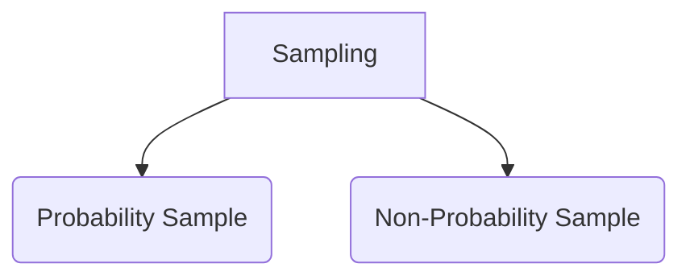
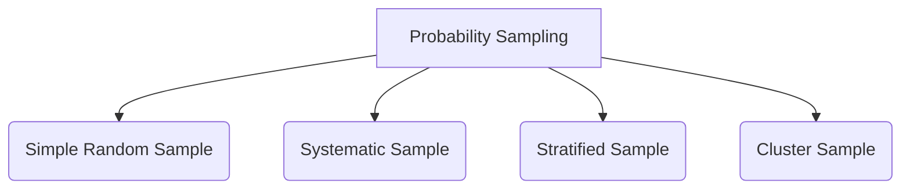
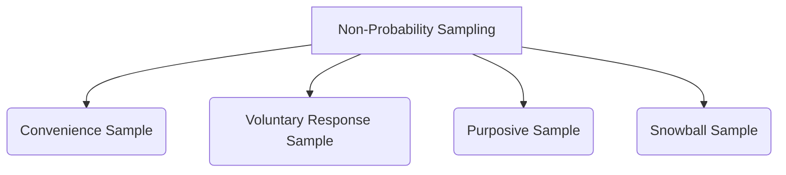

# Documentation for Topic Modeling and Sentiment Analysis

This is the codebase for developing Sentiment Analysis Model.

```mermaid
graph TD
	A[Sampling] --> B(Probability Sample)
	A --> C(Non-Probability Sample)
```

```mermaid
graph TD
	B[Probability Sampling] --> B1(Simple Random Sample)
	B --> B2(Systematic Sample)
	B --> B3(Stratified Sample)
	B --> B4(Cluster Sample)
```

```mermaid
graph TD
	C[Non-Probability Sampling] --> C1(Convenience Sample)
	C --> C2(Voluntary Response Sample)
	C --> C3(Purposive Sample)
	C --> C4(Snowball Sample)
```
